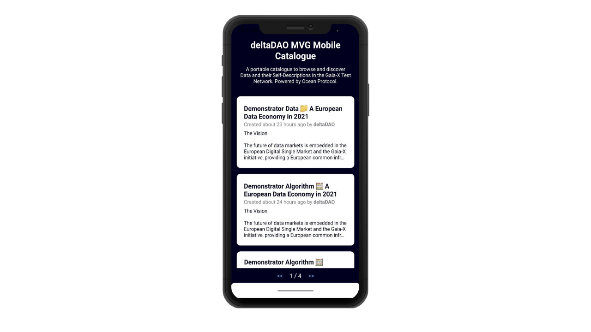

# GAIA-X Mobile Catalogue

A portable catalogue to browse and discover Data and their Self-Descriptions in the Gaia-X Test Network on your mobile device. Powered by Ocean Protocol.

## Installation

The project uses [Expo](https://expo.dev/) to build one project that runs natively on all modern mobile devices. It utilizes [React Native](https://reactnative.dev/) and uses TypeScript for type-safety and improved readability and maintainability.

```bash
# install dependencies
npm i -g expo
npm i

# start project
npm run start

# interact with project
Press a │ open Android
Press i │ open iOS simulator
Press w │ open web

Press r │ reload app
Press m │ toggle menu
Press d │ show developer tools
shift+d │ toggle auto opening developer tools on startup (enabled)
```



## Project Overview

The best entry point for this project is `App.tsx`. This is where all components and views are loaded for the app. Currently, it loads the `src/components/Header.tsx` displaying the description text and the `src/componetns/Catalogue.tsx` listing the metadata entries from Aquarius.

Aquarius provides an off-chain database storage for metadata of data assets. It is a service that is provided by the Ocean Protocol backend ([docs](https://docs.oceanprotocol.com/references/aquarius/)). The utils folder contains `utils/aquarius.ts` which provides a basic description of how a DID document (DDO) is returned from Aquarius and it provides functions to query it. Aquarius runs Elasticsearch under the hood, so its stored metadata can be queried with Elasticsearch queries. All initial data sets and metadata are loaded client-side on run-time from the Aquarius instance, defined in `config.js`.

## Environment Variables

The environment variables (`config.js`) can be used to quickly change your metadata provider (Aquarius) to display different assets from different markets. You only need to update `metadataCacheUri` to point to an Aquarius instance that you control or that you are allowed to access.

## Contributing

We appreciate bug reports, feature requests, code improvements, documentation contributions, and pull requests.

## License

```
Copyright 2021 deltaDAO AG.

Licensed under the Apache License, Version 2.0 (the "License");
you may not use this file except in compliance with the License.
You may obtain a copy of the License at

   http://www.apache.org/licenses/LICENSE-2.0

Unless required by applicable law or agreed to in writing, software
distributed under the License is distributed on an "AS IS" BASIS,
WITHOUT WARRANTIES OR CONDITIONS OF ANY KIND, either express or implied.
See the License for the specific language governing permissions and
limitations under the License.
```
